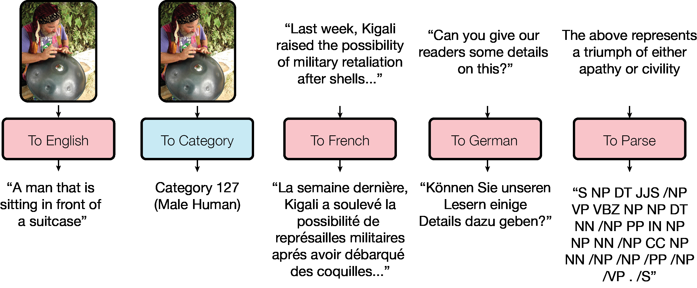
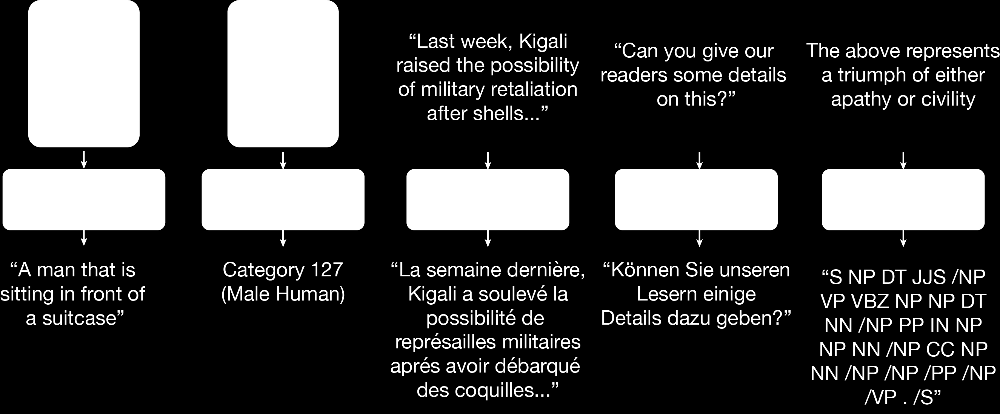
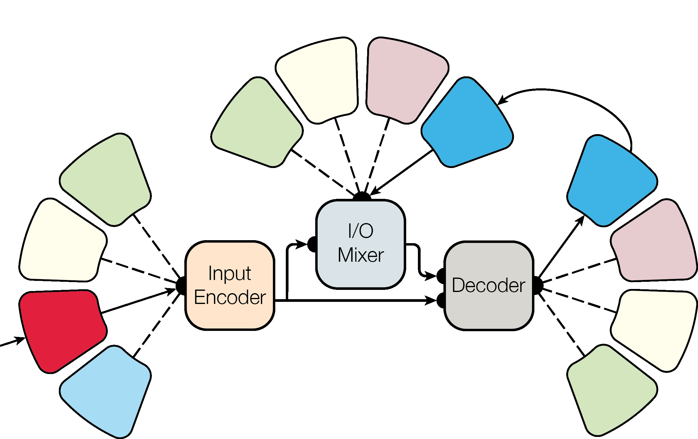

# One Model To Learn Them All
# 万能学习模型

Łukasz Kaiser Google Brain lukaszkaiser@google.com
Aidan N. Gomez∗ University of Toronto aidan@cs.toronto.edu
Noam Shazeer Google Brain noam@google.com
Ashish Vaswani Google Brain avaswani@google.com
Niki Parmar Google Research nikip@google.com
Llion Jones Google Research llion@google.com
Jakob Uszkoreit Google Research usz@google.com

## Abstract
## 摘要

Deep learning yields great results across many fields, from speech recognition, image classification, to translation. But for each problem, getting a deep model to work well involves research into the architecture and a long period of tuning.  We present a single model that yields good results on a number of problems spanning multiple domains. In particular, this single model is trained concurrently on ImageNet, multiple translation tasks, image captioning (COCO dataset), a speech recognition corpus, and an English parsing task. Our model architecture incorporates building blocks from multiple domains. It contains convolutional layers, an attention mechanism, and sparsely-gated layers. Each of these computational blocks is crucial for a subset of the tasks we train on. Interestingly, even if a block is not crucial for a task, we observe that adding it never hurts performance and in most cases improves it on all tasks. We also show that tasks with less data benefit largely from joint training with other tasks, while performance on large tasks degrades only slightly if at all.

深度学习在语音识别，图片分类,翻译等很多领域都取得了不错的结果。但是，针对每个问题，都要进行深入的研究架构然后还需要长时间的调优才能的到好的模型。我们提出了一个万能模型，在横跨多个领域的多个问题里都取得了不错的结果。这个模型同时在ImageNet,多语种翻译任务，图像生成字幕(COCO　数据集),一个语音识别语料以及一个英语解析任务上进行训练。我们的模型架构由多个领域的块构成。包括多个卷积层，一个注意力机制及多个稀疏门控层。每个计算块对我们训练的某些子任务都至关重要。有趣的是，即使某个块对某个任务不太重要，我们也发现加上他也在大多数情况下都会提升性能，至少不会减少性能。实验还表明数据量少的任务会受益与和其他大任务的联合训练，而对大任务的性能的减少即使有也非常有限。

## 1 Introduction
## 1 引言

Recent successes of deep neural networks have spanned many domains, from computer vision [13] to speech recognition [8] and many other tasks. Convolutional networks excel at tasks related to vision, while recurrent neural networks have proven successful at natural language processing tasks, e.g., at machine translation [27, 3, 4]. But in each case, the network was designed and tuned specifically for the problem at hand. This limits the impact of deep learning, as this effort needs to be repeated for each new task. It is also very different from the general nature of the human brain, which is able to learn many different tasks and benefit from transfer learning. The natural question arises: 

深度学习的最近的成功跨越了很多领域，从计算机视觉 [13] 到语音识别 [8] 以及很多其他的任务。卷积网络在视觉相关任务上表现优秀，而时间递归神经网络在自然语言处理任务上非常成功，比如机器翻译[27, 3,4].但是，在各自的场景下，网络都为了手头的问题而设计和调优。这限制了深度学习的影响，因为每个任务都要重复这一工作。而且这和人类大脑的特征也不一样，大脑可以学习各种各样的任务，并且从转移学习中收益。问题是:

Can we create a unified deep learning model to solve tasks across multiple domains?

我们可以创造一个解决多个领域任务的统一的深度学习模型吗？

The question about multi-task models has been studied in many papers in the deep learning literature.  Natural language processing models have been shown to benefit from a multi-task approach a long time ago [6], and recently machine translation models have even been shown to exhibit zero-shot learning when trained on multiple langauges [18]. Speech recognition has also been shown to benefit from multi-task training [24], as have some vision problems, such as facial landmark detection [31].  But all these models are trained on other tasks from the same domain: translation tasks are trained with other translation tasks, vision tasks with other vision tasks, speech tasks with other speech tasks. Multi-modal learning has been shown to improve learned representations in the unsupervised setting [20] and when used as a-priori known unrelated tasks [22]. But no competitive multi-task multi-modal model has been proposed, so the above question remains unanswered

关于多任务模型的这个问题已经在深度学习文献的很多论文里进行了研究。很久之前就证明自然语言处理模型可以在多任务方法中受益[6]。最近又证明机器翻译模型可以在多语种训练时达到零学习。语音识别同样被证明可以从多任务学习中受益 [24]。对于视觉问题，也是同样的情况，比如脸部特征点识别。但是这些任务都是在相同的领域内的其他任务上训练的：翻译任务基于其他翻译任务，视觉任务基于其他视觉任务，语音识别基于其他语音任务。多模式学习已经被证明可以在无监督设置时,以及被作为一个先验已知的无关任务时 改进学习表达。但是并没有提出具有竞争力的多任务多模式模型，因此上面的问题目前还是无解。

In this work, we take a step toward positively answering the above question by introducing the MultiModel architecture, a single deep-learning model that can simultaneously learn multiple tasks from various domains. Concretely, we train the MultiModel simultaneously on the following 8 corpora:

在这项工作中，我们通过引入多模式架构来积极的解答上述问题。单独这一个模型可以同时学习多个领域的任务。具体的说，我们通过在以下8个语料库上训练多模式模型:

(1) WSJ speech corpus [7]
(2) ImageNet dataset [23]
(3) COCO image captioning dataset [14]
(4) WSJ parsing dataset [17]
(5) WMT English-German translation corpus
(6) The reverse of the above: German-English translation.
(7) WMT English-French translation corpus
(8) The reverse of the above: German-French translation.

(1) WSJ 语音语料 [7]
(2) ImageNet 数据集 [23]
(3) COCO 图像字幕语料 [14]
(4) WSJ 解析数据集 [17]
(5) WMT 英德翻译译语料
(6) 上述预料的反转:德英互译语料
(5) WMT 英法翻译译语料
(6) 上述预料的反转:法英互译语料

The model learns all of the above tasks and achieves good performance: not state-of-the-art at present, but above many task-specific models studied in recent past (see the Section 3 for details).  Figure 1 illustrates some decodes taken directly from the model: it is clear that it can caption images, categorize them, translate to French and German and construct parse trees. While the MultiModel is only a first step and will be tuned and improved in the future, two key insights are crucial to making it work at all and are the main contributions of this work.

模型学习了上述所有任务后取得了不错的性能:目前不是最先进的，但是要比最近很多绑定单一任务的模型要好一些（细节参考第三章)。图１是直接从模型中提取的一些数据:很清楚他可以给图像添加字母，给他们归类，翻译为法语和德语并且构建解析树。这只是多模型的第一步，将来还需要调优和改进，两个关键的见解对于使其工作至关重要，这是这项工作的主要贡献.

__Small modality-specific sub-networks convert into a unified representation and back from it.__

__小型的特定模型的子网络转换为统一的表达及其反向操作__

To allow training on input data of widely different sizes and dimensions, such as images, sound waves and text, we need sub-networks to convert inputs into a joint representation space. We call these sub-networks modality nets as they are specific to each modality (images, speech, text) and define transformations between these external domains and a unified representation. We design modality nets to be computationally minimal, promoting heavy feature extraction and ensuring that the majority of computation is performed within the domain-agnostic body of the model. Since our model is auto-regressive, modality nets need to both convert the inputs into the unified representation and later convert from this representation into the output space. Two design decisions were important:

为了允许各种不同大小和维度的数据作为输入数据进行训练，比如,图片,声波和文本，我们需要一个子网络来将输入转换为一个联合表示空间。我们吧这些网络叫做模态,y因为他们是针对每个模态(图片，语音，文本)到统一表示的转换。我们将模态网定义到最小，促进重特征提取，保证大多数计算不需要领域知识。因为我们的模型是自动回归的，所以模态网继续支持将输入转换为统一表示，还需要支持将统一标识转换到输出空间。这两个设计决策很重要:

* The unified representation is variable-size. While a fixed-size representation is tempting and easier to implement, it creates a bottleneck and limits the performance of the model.
* Different tasks from the same domain share modality nets. We avoid creating a sub-network for every task, and prefer only to create one for every input modality. For example, all translation tasks share the same modality-net (and vocabulary), no matter for which language pair. This encourages generalization across tasks and allows to add new tasks on the fly.

* 统一标识的大小是可变的。虽然固定大小的表示非常诱人，而且很容易实现，但它会造成瓶颈并限制模型的性能
* 同一个领域的不同任务共享模态网络。我们避免为每个任务创建一个子网络，而更倾向于为所有输入创建一个。比如，所有翻译认为共享一个模态网络（以及词典),而不需要关心是那种语种对。这就鼓励了在任务见泛化，从而可以飞速添加一个新任务。

__Computational blocks of different kinds are crucial for good results on various problems.__

__不同的计算块需要在各种问题上都能的到良好的结果是至关重要的__

The body of the MultiModel incorporates building blocks from mutiple domains. We use depthwiseseparable convolutions, an attention mechanism, and sparsely-gated mixture-of-experts layers. These blocks were introduced in papers that belonged to different domains and were not studied before on tasks from other domains. For example, separable convolutions were introduced in the Xception architecture [5] and were not applied to text or speech processing before. On the other hand, the sparsely-gated mixture-of-experts [21] had been introduced for language processing tasks and has not been studied on image problems. We find that each of these mechanisms is indeed crucial for the domain it was introduced, e.g., attention is far more important for language-related tasks than for image-related ones. But, interestingly, adding these computational blocks never hurts performance, even on tasks they were not designed for. In fact we find that both attention and mixture-of-experts layers slightly improve performance of MultiModel on ImageNet, the task that needs them the least.  

多模型的主体由来自多领域的构建块构成。我们使用深度分离的卷积，注意力机制以及稀疏门控混合专家层。这些块由不同领域的论文引入，之前未在其他领域的任务中训练过。比如，可分离的卷积是在Xception架构中引入的，并未在文本和语音处理中应用过。另一方面，稀疏门口专家混合是在语言处理任务中引入，并没有在图片问题中学习过。我们发现这些机制对引入他们的领域来说是至关重要的，比如注意力在语言相关的任务中要比在图片相关的任务中重要。但有趣的是，增加计算块从来不会对性能造成损失，即使在那些并非是他们设计使用的任务来说也是这样。事实上，我们发现注意力和混合专家层都轻微的改进了多模型在ImageNet的性能，至少对这个任务来说，是需要他们的。

## 2 MultiModel Architecture

## 2 多模型架构

The MultiModel consists of a few small modality-nets, an encoder, I/O mixer, and an autoregressive decoder, as depicted in Figure 2. As already said above, the encoder and decoder are constructed using 3 key computational blocks to get good performance across different problems:

多模型包括一些小的模块网络，一个编码器，输入/输出混合器，一个自动回归解码器，如图２所示。就像之前所说的，为了在不同的问题中获取好的性能,编码器和解码器由３个重要的计算模块构建:

(1) Convolutions allow the model to detect local patterns and generalize across space.

(1) 卷积允许模型检测局部模式，并跨越空间进行泛化

(2) Attention layers allow to focus on specific elements to improve performance of the model.

(2) 注意层可以专注于特定的元素来提高模型的性能

(3) Sparsely-gated mixture-of-experts gives the model capacity without excessive computation cost.

(3) 稀疏门控的混合专家给出了模型的容量，而没有过多的计算成本。

We start by describing the architecture of each of these 3 blocks and then introduce the encoder, decoder and the architecture of our modality-nets.

我们首先描述这3个块中的每一个的架构，然后介绍编码器，解码器和模态网络的架构。

### 2.1 Convolutional Blocks
### 2.1 卷积块

To perform local computation, we use blocks of convolutions with ReLU non-linearities and normalization.  A block of convolutions gets as input a tensor of shape [batch size, sequence length, feature channels] and returns a tensor of the same shape, processed as follows.

为了执行本地计算，我们使用ReLU非线性和归一化的卷积块。 一组卷积作为输入形式的张量[批量大小，序列长度，特征通道]，并返回相同形状的张量，如下处理。

For convolution operations, we use depthwise separable convolutions, introduced in [5], in a way similar to [15]. Depthwise separable convolutions are a parameter- and computationally-efficient variant of the traditional convolution. They are defined by a convolution on each feature channel separately, followed by a pointwise convolution to project to the desired feature depth. We refer the reader to [5] for a complete definition; here we will denote a depthwise separable convolution with weights Wh×w corresponding to f kernels of size h × w applied to an input tensor x with stride s and dilated by a factor d (see [30]) as SepConvd,s,f (W, x). Note that subscripts for stride, dilation and output size are omitted when dilation d or stride s are equal to 1, or output size f is equal to the input’s feature depth.

对于卷积运算，我们采用[5]中引入的深度可分离卷积，类似于[15].深度可分离卷积是传统卷积的参数和计算上有效的变体。它们通过分别在每个特征通道上的卷积定义，随后是逐点卷积以投影到期望的特征深度。完整的定义参考引用[5];这里我们将表示一个深度方向的可分离卷积，其权重 }) 对应于f个大小为h×w核，其施加到具有步幅s的输入张量x并被因子d（参考[30]）扩展为}(W, x)) 注意，当扩张d或步幅s等于1时，或者输出尺寸f等于输入的特征深度时，省略步幅，扩张和输出尺寸的下标。

We use convolutions in blocks that consist of three components: a ReLU activation of the inputs, followed by a SepConv, followed by layer normalization. Layer normalization [2] acts over the h hidden units of the layer below, computing layer-wise statistics for each batch example and normalizing accordingly. These normalized units are then scaled and shifted by scalar learned parameters G and B respectively, producing the final units to be activated by a non-linearity. The complete convolution step is therefore defined as:

我们在由三个组件组成的块中使用卷积：ReLU激活输入，其次是SepConv，接着是层规一化。 层归一化[2]作用于下面层的h个隐藏单元，计算每个批次示例的分层统计，并相应地进行归一化。 然后，这些归一化单元分别被标量学习参数G和B缩放并移位，产生要被非线性激活的最终单元。 因此，完整的卷积步骤定义为：

=LN(SepConv_{d,s,f}(W,ReLU(x))))

_0

The convolutional steps are composed into blocks by stacking them and adding residual connections as depicted in Figure 3. We use stacks of four convolutional blocks with two skip-connections between the stack input and the outputs of the second and fourth convolutional steps, and with the first two having 3 × 1 kernels and the next two having 15 × 1 kernels, with the final one dilated by 8 to provide a wide receptive field. We also add 40% dropout at the end of each block, so the complete block is defined as follows:

步骤卷积通过堆叠它们并添加残余连接来组成块，如图3所示。我们使用四个卷积块的堆叠，在栈输入和第二和第四卷积步骤的输出之间具有两个跳过连接，并且与 前两个具有3×1内核，接下来的两个具有15×1个内核，最后一个扩展为8，以提供广泛的接收场。 我们还在每个块的末尾添加了40％丢弃率，因此完整的块定义如下：

=ConvStep(W_h1^{3*1},x))

=x+ConvStep(W_h2^{3*1},hidden1(x)))

=ConvStep(W_h3^{15*1},hidden2(x)))

=x+ConvStep_{d==8}(W_h4^{15*1},hidden3(x)))

### 2.2 Attention Blocks

### 2.2 注意力块

For attention, we use a multi-head dot-product attention mechanism inspired by [3] and similar to [1], as depicted in Figure 3. The inputs to the attention layer are two tensors: a source tensor and a target tensor both with the shape [batch size,sequence length, feature channels] The target tensor is additively composed with a timing signal and mixed using two convolutional blocks. This mixed tensor is then self-attended using a multi-head dot-product attention, which is a dot-product attention with inputs split into g = 8 separate tensors representing each attention head, as shown in Figure 3. The timing signals are the main difference between this attention mechanism and the ones used previously. They allow this content-based attention to focus based on their position. They are constructed by concatenating sine and cosine curves:

对于注意力，我们使用了由[3]和类似于[1]的multi-head dot-product注意力机制，如图3所示。注意力层的输入是两个张量：源张量和目标张量,两者形状都是[批量大小，序列长度，特征通道]目标张量还使用两个卷积块进行混合了时间信号。这个混合张量是自我注意的，使用multi-head dot-product注意力，这是一个dot-product注意，输入分成g = 8个独立张量，表示每个注意head，如图3所示。时间信号是注意力机制与以前使用的机制之间的主要区别。 它们允许基于内容的注意力集中在他们的位置上。 它们通过连接正弦和余弦曲线构成：

=1e4^{-\frac{2d}{depth}})

=[sin(t\Delta(2d))||_2cos(t\Delta(2d))])

_0

where  represent concatenation of a and b along the d th dimension. The source tensor is finally passed through two different pointwise convolutions to generate the memory keys K and values V and the query keys, memory keys and memory values are used to apply the attention mechanism between the self-attended target and the source (see Figure 3).

其中  表示沿着第d维的a和b的级联。 源张量最终通过两个不同的逐点卷积以产生存储键K和值V，以及查询key，存储器键和存储器值来在自参与目标和源之间应用注意机制（参见图3）。

### 2.4 Encoder and Mixer and Decoder

### 2.4 编码器，混合器，解码器

The body of the MultiModel consists of 3 parts: the encoder that only processes the inputs, the mixer that mixes the encoded inputs with previous outputs (autoregressive part), and a decoder that processes the inputs and the mixture to generate new outputs.

MultiModel的主体由3部分组成：仅处理输入的编码器，将编码输入与先前输出（自动回归部分）混合的混和器以及处理输入和混合以产生新输出的解码器。

The encoder, mixer and decoder are structured similarly to previous fully convolutional sequence to sequence models such as ByteNet [11] or WaveNet [29], but differ in the computational blocks that are used. We depict their architecture in Figure 3. As can be seen there, the encoder consists of 6 repeated convolutional blocks (described before) with a mixture-of-experts layer in the middle. The mixer consists of an attention block and 2 convolutional blocks. The decoder consists of 4 blocks of convolutions and attention, with a mixture-of-experts layer in the middle. Crucially, the convolutions in the mixer and decoder are padded on the left, so they can never access any information in the future.  This allows the model to be autoregressive, and this convolutional autoregressive generation scheme offers large receptive fields over the inputs and past outputs, which are capable of establishing long term dependencies.  

编码器，混和器和解码器的结构类似于以前的完整的序列到序列模型卷积，如ByteNet [11]或WaveNet [29]，但于在所计算模块中使用的不同。 我们在图3中描绘了它们的架构。从图中可以看出，编码器由6个重复的卷积块（如前所述）组成，中间有专家混合层。 混合器由一个注意力块和2个卷积块组成。 解码器由四个卷积和注意力组成，中间有专家混合层。 关键的是，混音器和解码器中的卷积填充在左边，所以他们将来永远不会访问任何信息。 这允许模型是自回归的，并且这种卷积自回归生成方案在输入和之前的输出上提供了大型接收字段，这能够建立长期依赖性。

To allow the decoder to produce outputs for different tasks even with the same modality, we always start decoding with a command-token, such as To-English or To-Parse-Tree. We learn an embedding vector corresponding to each of the tokens during training.

为了允许解码器为不同任务生成输出，即使使用相同的模式，我们总是使用命令令牌开始解码，例如To-English或To-Parse-Tree。 我们在训练期间学习一个与每个令牌相对应的嵌入矢量。

### 2.5 Modality Nets

### 2.5 模态网络

We have 4 modality nets, for language (text data), images, audio, and categorical data.

我们有４个模态网络，分别是语言(文本数据),图片，音频,分类数据

#### 2.5.1 Language modality net

#### 2.5.1 语言模态网络

Our language-based data is all tokenized using the same vocabulary with 8k subword-units, following the method from [25]. The language input modality takes a sequence of tokens ending in a termination token. This sequence of tokens is mapped to the correct dimensionality for the body using a learned embedding. On the output side, the language modality takes the decoded output of the body and performs a learned linear mapping, followed by a Softmax, resulting in a probability distribution over the token vocabulary.

按照[25]的方法，我们基于语言的数据使用同一个8k subwod-unit的词汇进行标记化。 语言输入模式采用终止令牌结束的令牌序列。 使用学习的嵌入将该令牌序列映射到正确的维度。 在输出端，语言模式采用解码输出，并执行学习的线性映射，随后是Softmax，生成令牌词汇表的概率分布。

=W_E\cdot{x})

=Softmax(W_S\cdot{x}))

#### 2.5.2 Image modality net

#### 2.5.2 图片模态网络

The image input modality is analogous to the Xception entry flow [5]. The input image’s feature depth is gradually deepened using residual convolution blocks which we call ConvRes and define as follows:

图像输入模式类似于Xception入口流程[5]。 输入图像的特征深度使用残差卷积块逐渐加深，我们称之为ConvRes，并定义如下：

=ConvStep_{f=F}(W^{3\times3},x))
=ConvStep_{f=F}(W^{3\times3},c1(x,F)))
=MaxPool_2([3\times3],c2(x,F)))
=p1(x,F)+ConvStep_{s=2}(W^{1\times1},x))

_0

where )  is a max-pooling layer over x with stride s and window shape [h x w] The ImageModality input flow with network depth d (we use d = 1024) is defined as:

其中 ) 是x上的最大池层，具有步幅和窗口形状[h x w] 具有网络深度d（我们使用d = 1024）的ImageModality输入流定义为：

=ConvStep_{s=2,f=32}(W^{3\times3},x))

=ConvStep_{f=64}(W^{3\times3},h1(x)))

=ConvRes(h2(x),128))

=ConvRes(r1(x),256))

=ConvRes(r2(x),d))

#### 2.5.3 Categorical modality net

#### 2.5.3 分类模态网络

The categorical output modality is analogous to the Xception exit flow [5]. If the network inputs are two-dimensional data such as image or spectral audio data, then the one-dimensional output from the model body is first reshaped into two-dimensions again, followed by progressive down-sampling:

分类输出模态类似于Xception退出流[5]。 如果网络输入是诸如图像或光谱音频数据的二维数据，则来自模型体的一维输出首先被重构为二维，然后是逐行下采样：

=ConvStep_{s=2}(W^{3\times3}_{skip},x))

=ConvStep(W_{h1}^{3\times3},x))

=ConvStep(W_{h2}^{3\times3},h1(x)))

=skip(x)+MaxPool_2([3\times3],h2(x)))

=ConvStep_{f=1536}(W_{h3}^{3\times3},h3(x)))

=ConvStep_{f=2048}^(W^{3\times3},h4(x)))

=GlobalAvgPool(RELU(h5(x))))

=PointwiseConv(W^{classes},h6(x)))

GlobalAvgPool denotes a mean taken across all spatial and temporal dimensions.

GlobalAvgPool表示跨越所有空间和时间维度的平均值。

#### 2.5.4 Audio modality net

#### 2.5.4 音频模态网络

We accept audio input in the form of a 1-dimensional waveform over time or as a 2-dimensional spectrogram. Both the waveform and spectral input modalities use a stack of 8 ConvRes blocks from the ImageInputModality (Section 2.5.2). The i th block has the form:).  The spectral modality does not perform any striding along the frequency bin dimension, preserving full resolution in the spectral domain.

我们以一维波形的形式接受音频输入，或者作为二维频谱图。 波形和频谱输入模式都使用来自ImageInputModality（第2.5.2节）的8个ConvRes块的堆栈。 第i个块的格式为, ) 。 频谱模式不沿着频率仓尺寸执行任何步进，保持频谱域中的全分辨率。

### 2.6 Related Models

### 2.6 相关模型

The MultiModel architecture draws from eariler encoder-decoder architectures applied to neural machine translation. Earlier sequence-to-sequence models for translation [27, 3, 4] used recurrent neural networks (RNNs) with long short-term memory cells [9]). Convolutional architectures yielded good results on word-level neural machine translation starting from [10] and later in [19]. These early models used a standard RNN on top of the convolution to generate the output and had a bottleneck there that hurt performance, especially on longer sentences, similarly to the limitations of RNN sequence-to-sequence models without attention [27, 4]. Fully convolutional neural machine translation without this bottleneck was presented in [16, 11]. The model in [16] (Extended Neural GPU) used a recurrent stack of gated convolutional layers, while the model in [11] (ByteNet) did away with recursion and used left-padded convolutions in the decoder. This idea, introduced in WaveNet [29] and also used in MultiModel (see above) significantly improves efficiency. Depthwise separable convolutions were first studied by Sifre [26] and later they were used to get good results on large-scale image classification with Xception [5].  

MultiModel架构来自于应用于神经机器翻译的耳机编码器 - 解码器架构。早期的序列 - 序列模型的翻译[27,3,4]使用具有长短记忆细胞的复发神经网络（RNN）[9]）。卷积式架构从[10]和[19]之后开始，对词级神经机器翻译产生了良好的效果。这些早期模型在卷积之上使用标准的RNN来产生输出，并且在那里产生了一个瓶颈，从而影响性能，特别是对较长的句子，类似于RNN序列到序列模型的限制，没有注意力[27,4]。 [16，11]提出了没有这个瓶颈的完全卷积神经机器翻译。 [16]（扩展神经GPU）中的模型使用了门控卷积层的时间递归堆栈，而[11]（ByteNet）中的模型消除了递归，并在解码器中使用了左填充卷积。 WaveNet [29]中引入并在MultiModel中使用的这个想法（见上文）显着提高了效率。 Sifre [26]首先研究了深度可分离卷积，随后用Xception在大规模图像分类中获得了较好的结果[5]。

## 3 Experiments

## 3 实验

We implemented the MultiModel architecture described above using TensorFlow and trained it in a number of configurations. In all training runs reported below we used the same set of hyperparameters and the Adam optimizer [12] with gradient clipping. We will release the implementation as open-source together with the details of our setup and all used hyper-parameters. We focused our experiments so as to answer the following questions:

我们使用TensorFlow实现了上述的MultiModel体系结构，并对其进行了许多配置的训练。 在下面报告的所有训练运行中，我们使用了相同的一组超参数和Adam优化器[12]和梯度削波。 我们将作为开放源代码发布实现，以及我们的设置和所有使用的超参数的细节。 我们专注于实验，以回答以下问题：

(1) How far is the MultiModel trained on 8 tasks simultaneously from state-of-the-art results?
(2) How does training on 8 tasks simultaneously compare to training on each task separately?
(3) How do the different computational blocks discussed above influence different tasks?

（1）MultiModel从最先进的结果同时对8项任务进行了多少训练？
（2）8个任务的训练如何与每个任务的训练分别进行比较？
（3）上述不同的计算模块如何影响不同的任务？

| Problem                    |  MultiModel (joint 8-problem)  | State of the art |
| :------------------------- |:------------------------------:| ----------------:|
| ImageNet (top-5 accuracy   | 86%                            |  95%             |
| WMT EN → DE (BLEU)         | 21.2                           |  26.0            |
| WMT EN → FR (BLEU)         | 30.5                           |  40.5            |

Table 1: Comparing MultiModel to state-of-the-art from [28] and [21].

<table>
  <thead>
    <tr><td rowspan="2"> Problem </td><td colspan="2">Joint 8-problem</td><td colspan="2">Single problem</td></tr>
    <tr><td> log(perpexity) </td><td> accuracy </td><td> log(perplexity) </td><td> accuracy </td></tr>
  </thead>
  <tbody>
    <tr><td>ImageNet</td><td>1.7</td><td>66%</td><td>1.6</td><td>67%</td></tr>
    <tr><td>WMT EN→DE</td><td>1.4</td><td>72%</td><td>1.4</td><td>71%</td></tr>
    <tr><td>WSJ speech</td><td>4.4</td><td>41%</td><td>5.7</td><td>23%</td></tr>
    <tr><td>Parsing</td><td>0.15</td><td>98%</td><td>0.2</td><td>97%</td></tr>
  </tbody>
</table>

Table 2: Comparison of the MultiModel trained jointly on 8 tasks and separately on each task.

In answering the above questions, we don’t always consider all 8 problems. Especially the 4 translation problems behave very similarly, so we decided to not include them all in each comparison but we focused on the more varied problems instead.

在回答上述问题时，我们并不总是考虑所有8个问题。 特别是4个翻译问题的行为非常类似，所以我们决定不把它们全部包含在每个比较中，但是我们专注于更多样化的问题。

To answer question (1), we compare the performance of the 8-problem MultiModel with state-of-theart results in Table 1. We did not invest much time yet in tuning hyper-parameters of the MultiModel, so we believe that the difference seen there will become much smaller with more tuning. The results we achieve are similar to the ones task-specific models get without heavy tuning, e.g., on English-French translation we improve on the Extended Neural GPU results reported last year [16].

为了回答问题（1），我们将8个问题的MultiModel的性能与表1中的状态进行比较。我们没有花费太多时间调整MultiModel的超参数，所以我们认为差异会随着更多的调整将变得更小。 我们实现的结果类似于任务特定模型而没有大量调优，例如，我们在去年报告的扩展神经GPU结果中改进了英文 - 法文翻译[16]。

To answer question (2), we compare the MultiModel trained jointly with MultiModel trained separately just on a single task. When training jointly on 8 tasks, we had a separate worker training on each task with shared parameters of the model. When training on a single task, we used only a single worker training on this task for a similar number of steps. Since we are comparing different instantiations of the same model, we report two internal metrics: the negative log-perplexity and per-token accuracy (measured on the development set). As can be seen from the results in Table 2, the joint 8-problem model performs similarly to single-model on large tasks, and better, sometimes significantly, on tasks where less data is available, such as parsing.  

为了回答问题（2），我们比较了在单个任务上单独训练的MultiModel联合训练的MultiModel。 在共同对8个任务进行训练时，我们对每个任务进行了单独的工作人员的训练，具有模型的共享参数。 当对单个任务进行训练时，我们仅使用单一的worker训练来完成此类任务。 由于我们正在比较同一模型的不同实例，因此我们报告了两个内部度量标准：negative log-perplexity和每令牌的准确性（在开发集上衡量）。 从表2的结果可以看出，联合8问题模型与大型任务中的单一模型类似，并且在有较少数据可用的任务（如解析）上更好地，有时显着地执行。

The large improvement on parsing seen in Table 2 is not that surprising taking into account the large number of text data in translation tasks. But we were curious if training parsing just with ImageNet, a seemingly unrelated task, would also bring any improvements. This is indeed the case, as can be seen in Table 3. The difference in performance is significant, and since we use both dropout and early stopping, we conjecture that it is not related to over-fitting. Rather, it seems, there are computational primitives shared between different tasks that allow for some transfer learning even between such seemingly unrelated tasks as ImageNet and parsing.

考虑到翻译任务中的大量文本数据，表2中所看到的解析的巨大改进并不令人惊讶。 但是，如果使用ImageNet进行解析，这个看似无关的任务也会带来任何改进，我们很好奇。 事实确实如此，从表3可以看出，绩效差异很大，既然我们同时使用了退出和提前停止，我们推测它与过度配合无关。 相反，似乎有不同任务之间共享的计算原语，即使在像ImageNet和解析这样看似无关的任务之间也允许一些转移学习。

To answer question (3), we check how training without the mixture-of-experts layers or without the attention mechanism influences performance on different problems. Since both these mechanisms were designed with machine translation in mind, we check the English-French translation. But we also include ImageNet, since this is the problem that stands the least to benefit from those blocks. In fact, one could expect that removing these blocks will improve performance on ImageNet alone if they were truly useless for this task. In contrast, we see in Table 4 that these blocks either don’t affect or slightly improve performance. This leads us to conclude that mixing different computation blocks is in fact a good way to improve performance on many various tasks.  

为了回答问题（3），我们检查如果没有混合专家层或没有注意机制的训练会影响不同问题的绩效。 由于这两种机制都是用机器翻译设计的，所以我们检查英文 - 法文翻译。 但是我们也包括ImageNet，因为这是从这些块中受益的问题。 事实上，除了这些功能块之外，如果它们对于这个任务真的没用，那么可以单独改进ImageNet上的性能。 相比之下，我们在表4中看到，这些块不影响或稍微提高性能。 这导致我们得出结论：混合不同的计算块实际上是改善许多各种任务的性能的好方法。

<table>
  <thead>
    <tr><td rowspan="2"> Problem </td><td colspan="3">Alone</td><td colspan="3">W/ ImageNet</td><td colspan="3"> W/ 8 Problems</td></tr>
    <tr><td>log(ppl)</td><td>acc.</td><td>full</td><td> log(ppl)</td><td>acc.</td><td>full</td><td>log(ppl)</td><td>acc.</td><td>full</td></tr>
  </thead>
  <tbody>
    <tr><td>Parsing</td><td>0.20</td><td>97.1%</td><td>11.7%</td><td>0.16</td><td>97.5%</td><td>12.7%</td><td>0.15</td><td>97.9%</td><td>14.5%</td></tr>
  </tbody>
</table>

Table 3: Results on training parsing alone, with ImageNet, and with 8 other tasks. We report log-perplexity, per-token accuracy, and the percentage of fully correct parse trees.

<table>
  <thead>
    <tr><td rowspan="2"> Problem </td><td colspan="2">All Blocks</td><td colspan="2">Without MoE</td><td colspan="2">Without Attention</td></tr>
    <tr><td>log(perpexity)</td><td>accuracy</td><td>log(perplexity)</td><td>accuracy</td><td>log(perplexity)</td><td>accuracy</td></tr>
  </thead>
  <tbody>
    <tr><td>ImageNet</td><td>1.6</td><td>67%</td><td>1.6</td><td>66%</td><td>1.6</td><td>67%</td></tr>
    <tr><td>WMT EN→FR</td><td>1.2</td><td>76%</td><td>1.3</td><td>74%</td><td>1.4</td><td>72%</td></tr>
  </tbody>
</table>

Table 4: Ablating mixture-of-experts and attention from MultiModel training

## 4 Conclusions

## 4 结论

We demonstrate, for the first time, that a single deep learning model can jointly learn a number of large-scale tasks from multiple domains. The key to success comes from designing a multi-modal architecture in which as many parameters as possible are shared and from using computational blocks from different domains together. We believe that this treads a path towards interesting future work on more general deep learning architectures, especially since our model shows transfer learning from tasks with a large amount of available data to ones where the data is limited.

我们首次证明，单一的深度学习模式可以从多个领域共同学习一些大型的任务。 成功的关键在于设计一种多模式架构，其中共享尽可能多的参数，并从不同领域使用计算块。 我们相信，这将在更广泛的深度学习架构上走向有趣的未来工作的道路，特别是因为我们的模型显示了将大量可用数据的任务转移到数据有限的任务中。

References
[1] Niki Parmar Jakob Uszkoreit Llion Jones Aidan N. Gomez Lukasz Kaiser Illia Polosukhin Ashish Vaswani, Noam Shazeer. Attention is all you need. arXiv preprint arXiv:1706.03762, 2017.
[2] Jimmy Lei Ba, Jamie Ryan Kiros, and Geoffrey E Hinton. Layer normalization. arXiv preprint arXiv:1607.06450, 2016.
[3] Dzmitry Bahdanau, Kyunghyun Cho, and Yoshua Bengio. Neural machine translation by jointly learning to align and translate. CoRR, abs/1409.0473, 2014. URL http://arxiv.org/abs/ 1409.0473.
[4] Kyunghyun Cho, Bart van Merrienboer, Caglar Gulcehre, Fethi Bougares, Holger Schwenk, and Yoshua Bengio. Learning phrase representations using rnn encoder-decoder for statistical machine translation. CoRR, abs/1406.1078, 2014. URL http://arxiv.org/abs/1406.  1078.
[5] Francois Chollet. Xception: Deep learning with depthwise separable convolutions. arXiv preprint arXiv:1610.02357, 2016.
[6] Ronan Collobert and Jason Weston. A unified architecture for natural language processing: deep neural networks with multitask learning. In Proceedings of the 25th International Conference on Machine learning, pages 160–167, 2008.
[7] Linguistic Data Consortium et al. Csr-ii (wsj1) complete. Linguistic Data Consortium, Philadelphia, vol. LDC94S13A, 1994.
[8] George E. Dahl, Dong Yu, Li Deng, and Alex Acero. Context-dependent pre-trained deep neural networks for large-vocabulary speech recognition. IEEE Transactions on Audio, Speech & Language Processing, 20(1):30–42, 2012.  8
[9] Sepp Hochreiter and Jürgen Schmidhuber. Long short-term memory. Neural computation, 9(8): 1735–1780, 1997.
[10] Nal Kalchbrenner and Phil Blunsom. Recurrent continuous translation models. In Proceedings EMNLP 2013, pages 1700–1709, 2013. URL http://nal.co/papers/ KalchbrennerBlunsom_EMNLP13.
[11] Nal Kalchbrenner, Lasse Espeholt, Karen Simonyan, Aaron van den Oord, Alex Graves, and Koray Kavukcuoglu. Neural machine translation in linear time. arXiv preprint arXiv:1610.10099, 2016.
[12] Diederik P. Kingma and Jimmy Ba. Adam: A method for stochastic optimization. CoRR, abs/1412.6980, 2014. URL http://arxiv.org/abs/1412.6980.
[13] Alex Krizhevsky, Ilya Sutskever, and Geoffrey Hinton. Imagenet classification with deep convolutional neural network. In Advances in Neural Information Processing Systems, 2012.
[14] Tsung-Yi Lin, Michael Maire, Serge J. Belongie, Lubomir D. Bourdev, Ross B. Girshick, James Hays, Pietro Perona, Deva Ramanan, Piotr Dollár, and C. Lawrence Zitnick. Microsoft COCO: common objects in context. CoRR, abs/1405.0312, 2014. URL http://arxiv.org/abs/ 1405.0312.
[15] Francois Chollet Łukasz Kaiser, Aidan N. Gomez. Depthwise separable convolutions for neural machine translation. arXiv preprint arXiv:1706.03059, 2017.
[16] Samy Bengio Łukasz Kaiser. Can active memory replace attention? In Advances in Neural Information Processing Systems, (NIPS), 2016.
[17] Mitchell P Marcus, Beatrice Santorini, Mary Ann Marcinkiewicz, and Ann Taylor. Treebank-3 ldc99t42. CD-ROM. Philadelphia, Penn.: Linguistic Data Consortium, 1999.
[18] Quoc V. Le Maxim Krikun Yonghui Wu Zhifeng Chen Nikhil Thorat Fernanda Viégas Martin Wattenberg Greg Corrado Macduff Hughes Jeffrey Dean Melvin Johnson, Mike Schuster.  Google’s multilingual neural machine translation system: Enabling zero-shot translation. arXiv preprint arXiv:1611.04558, 2016.
[19] Fandong Meng, Zhengdong Lu, Mingxuan Wang, Hang Li, Wenbin Jiang, and Qun Liu.  Encoding source language with convolutional neural network for machine translation. In ACL, pages 20–30, 2015.
[20] Jiquan Ngiam, Aditya Khosla, Mingyu Kim, Juhan Nam, Honglak Lee, and Andrew Y. Ng.  Multimodal deep learning. In Proceedings of ICML’11, pages 689–696, 2011.
[21] Krzysztof Maziarz Andy Davis Quoc Le Geoffrey Hinton Jeff Dean Noam Shazeer, Azalia Mirhoseini. Outrageously large neural networks: The sparsely-gated mixture-of-experts layer. arXiv preprint 1701.06538, 2017.
[22] Bernardino Romera-Paredes, Andreas Argyriou, Nadia Berthouze, and Massimiliano Pontil.  Exploiting unrelated tasks in multi-task learning. In JMLR Proceedings of AISTATS’12, pages 951–959, 2012.
[23] Olga Russakovsky, Jia Deng, Hao Su, Jonathan Krause, Sanjeev Satheesh, Sean Ma, Zhiheng Huang, Andrej Karpathy, Aditya Khosla, Michael Bernstein, Alexander C. Berg, and Li Fei-Fei.  ImageNet Large Scale Visual Recognition Challenge. International Journal of Computer Vision (IJCV), 115(3):211–252, 2015. doi: 10.1007/s11263-015-0816-y.
[24] Michael L. Seltzer and Jasha Droppo. Multi-task learning in deep neural networks for improved phoneme recognition. In Proceedings of the IEEE International Conference on Acoustics, Speech and Signal Processing (ICASSP’13), 2013.
[25] Rico Sennrich, Barry Haddow, and Alexandra Birch. Neural machine translation of rare words with subword units. CoRR, 2015.  9
[26] Laurent Sifre and Stéphane Mallat. Rotation, scaling and deformation invariant scattering for texture discrimination. In 2013 IEEE Conference on Computer Vision and Pattern Recognition, Portland, OR, USA, June 23-28, 2013, pages 1233–1240, 2013.
[27] Ilya Sutskever, Oriol Vinyals, and Quoc VV Le. Sequence to sequence learning with neural networks. In Advances in Neural Information Processing Systems, pages 3104–3112, 2014.  URL http://arxiv.org/abs/1409.3215.
[28] Christian Szegedy, Sergey Ioffe, and Vincent Vanhoucke. Inception-v4, inception-resnet and the impact of residual connections on learning. CoRR, abs/1602.07261, 2016.
[29] Aäron van den Oord, Sander Dieleman, Heiga Zen, Karen Simonyan, Oriol Vinyals, Alex Graves, Nal Kalchbrenner, Andrew Senior, and Koray Kavukcuoglu. Wavenet: A generative model for raw audio. CoRR abs/1609.03499, 2016.
[30] Fisher Yu and Vladlen Koltun. Multi-scale context aggregation by dilated convolutions. arXiv preprint arXiv:1511.07122, 2015.
[31] Loy C.C. Tang X. Zhang Z., Luo P. Facial landmark detection by deep multi-task learning. In Proceedings of ECCV’14, 2014.
