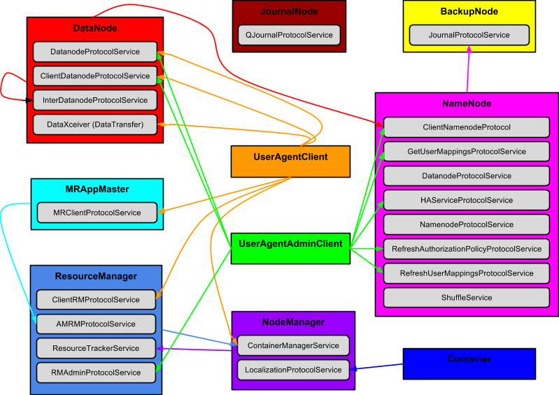

https://docs.google.com/document/d/1POyKfDxZaMNVJi-4c2mpJUfuSBch1arW-pc5xvUKNno

# Hadoop Security Analysis
# Hadoop安全性分析

NOTE: This is a working draft. Notes are being collected and will be edited for readability.

注意：这是一个工作草案。Notes are being collected and will be edited for readability.

## Introduction
## 引言

This document describes the state of security in a Hadoop YARN cluster.  First, this document describes the following entities and their interactions in a secure Hadoop cluster: tokens, principals, authentication mechanisms, authenticating parties, authorization mechanisms, authorized parties, and execution environment. Second, it examines these entities through the lens of adherence to commonly held security principles.

本文档描述了Hadoop YARN集群里的安全状态。首先，本文档描述了在一个安全的Hadoop集群里下面这几种实体以及他们之间的交互：tokens, principals, authentication mechanisms, authenticating parties, authorization mechanisms, authorized parties, 以及 execution environment。第二，it examines these entities through the lens of adherence to commonly held security principles。

## Tokens
## Tokens

In general, tokens are added to the current
[UGI](http://hadoop.apache.org/docs/stable/api/org/apache/hadoop/security/UserGroupInformation.html)?(UserGroupInformation.java).
?This results in those tokens being added as credentials to the
[JAAS](http://docs.oracle.com/javase/7/docs/technotes/guides/security/jaas/JAASRefGuide.html)[?](http://docs.oracle.com/javase/7/docs/technotes/guides/security/jaas/JAASRefGuide.html)[Subject](http://docs.oracle.com/javase/7/docs/technotes/guides/security/jaas/JAASRefGuide.html#Subject)[?](http://docs.oracle.com/javase/7/docs/technotes/guides/security/jaas/JAASRefGuide.html#Subject)associated
with that UGI. ?An RPC call is then made in the context of a
UGI.doAs?which pushes the Subject onto the thread context.

When a connection to a server is created, an appropriate token is
selected from a UGI created from the current JAAS Subject. ?This can be
seen in the getProtocolProxy methods of the RPC class:
hadoop-common-project/hadoop-common/src/main/java/org/apache/hadoop/ipc/RPC.java.

This selection is based on the type of server to which the connection is
being established and the type of token it requires. ?(See Connector
constructor in
hadoop-common-project/hadoop-common/src/main/java/org/apache/hadoop/ipc/Client.java.)

See method getProxy (lines 182-198) in ClientServiceDelegate for an
example of how tokens are set up by clients:
?hadoop-mapreduce-project/hadoop-mapreduce-client/hadoop-mapreduce-client-jobclient/src/main/java/org/apache/hadoop/mapred/ClientServiceDelegate.java.

Each service that generates tokens has a master key that is used to
generate a?Message Authentication Code?(MAC) for the token. This is also
referred to as the token password. Servers store their master key in a
SecretManager used with each RPC server. ?In several situations this
master key is distributed between master and slaves services by
registration or heartbeat interactions initiated by the slave services.

* * * * *

Principals {.c1}
==========

* * * * *

Here we define the entities that may be authenticated and granted rights
within a Hadoop cluster.

User {.c1}
----

Users are internally represented within Hadoop as simple strings. ?At
the boundaries various mechanisms are used to derive these simple
strings. ?For example these could be derived from a Kerberos principal
exchanged via
[SASL](http://en.wikipedia.org/wiki/Simple_Authentication_and_Security_Layer)?or
[SPNego](http://en.wikipedia.org/wiki/SPNEGO). ?They could also be
derived from the OS user running the client process. ?This user
information is collected in an object that is frequently referred to as
the
[UGI](http://hadoop.apache.org/docs/stable/api/org/apache/hadoop/security/UserGroupInformation.html)?(UserGroupInformation.java):

hadoop-common-project/hadoop-common/src/main/java/org/apache/hadoop/security/UserGroupInformation.java.

Group information is also represented internally within Hadoop as a
simple collection of strings. ?This group information is also carried
with the UGI. ?There is a pluggable mechanism by which a user name is
resolved into a list of groups. ?This plugin mechanism is called
GropuMappingServiceProvider:

hadoop-common-project/hadoop-common/src/main/java/org/apache/hadoop/security/GroupMappingServiceProvider.java.
You can see how these plugins are utilized by looking at the getGroups
method of the Groups class:
hadoop-common-project/hadoop-common/src/main/java/org/apache/hadoop/security/Groups.java

Core Services {.c1}
-------------

For each of the core services within a Hadoop cluster there is an
associated Kerberos UPN. These UPNs are utilized for server-server and
client-server interactions. The expected UPN values for each service are
stored in the Hadoop configuration files. The service credentials are
stored in keytab files and protected by native filesystem permissions.

Service

Description

HDFS NameNode

Manages HDFS meta data. Central point of HDFS access.

HDFS Secondary NameNode

Stores backup of HDFS meta datalogs.

HDFS DataNode

Manages HDFS data blocks.

YARN ResourceManager

Schedules container execution within a cluster.

YARN NodeManager

Manages container execution and shuffle results on one machine.

MapReduce JobHistory Server

Manages job history across a cluster.

Container {.c1}
---------

At its core YARN provides the ability to execute user code across
machines in a cluster. This user code is executed in an environment
called a container. Each container has an identity (ContainerId) and
associated token (ContainerTokenIdentifier) created by the
ResourceManager. ?

A Container token is required to access the ContainerManager?network
interface which is hosted in the NodeManager. These Container tokens are
held by the ApplicationMaster that created the container. The master
secret for token creation is controlled by the ResourceManager. ?The
ResourceManager?is the issuing party for tokens.

Job {.c1}
---

At this time Map Reduce is the mostly commonly deployed YARN
application. A job is one the of concepts that exists at the MR
application level. A job identity (JobId) is created by the MapReduce
ApplicationMaster. The JobId is contained within a Job token
(JobTokenIdentifier). ?The Job token is used by all Job tasks for mutual
authentication when communicating with the MapReduce ApplicationMaster.

Application {.c1}
-----------

An application instance has an identity (ApplicationId) and a token
(ApplicationToken) created by the ResourceManager. ?A client will
utilize an application id to uniquely identify an application instance.
The identity is requested by the client via
ClientRMService.getNewApplicationId(). ?The ApplicationMaster may also
identify itselft to the system using this ID.

Localizer {.c1}
---------

A Localizer is a short lived process launched by the NodeManager. ?It is
responsible for setting up the execution environment for a task. ?This
includes extracting the required job files from HDFS to the local file
system. A Localizer’s?identity is represented by a
LocalizerTokenIdentifier that allows the Localizer to report status back
to the launching NameNode.

Node {.c1}
----

A?NodeManager represents each node (computer) in a cluster.? Each
NodeManager has a unique Kerberos principal associated with it. ?The
NodeManagers are always running and interact with the ResourceManager to
provide information about the state of the node and the
ApplicationMasters to execute tasks.

Resources {.c1}
=========

TODO - Overview

Block {.c1}
-----

A block of data within HDFS is identified by a 64-bit integer. The
NameNode allocates a block identifier when data is written to a file.
The NameNode also stores metadata for this block identifier. The
metadata tracks the association between a file and its blocks, and
between blocks the DataNodes on which they are stored (included
replicas). The lifecycle of a block identifier is controlled by the
owner of the file to which the block belongs. A block identifier becomes
invalid once the file to which it belongs is deleted.

Shuffle Data (user/Job Identifier/Map Identifier) {.c1}
-------------------------------------------------

Shuffle data is the output of the Map portion of a MapReduce job. ?It is
generated by the Map task and stored on the local file system where the
Map task was executed. ?When the Reduce task of a MapReduce job is run,
this data is fetched by accessing a NodeManager component called the
ShuffleHandler. ?This is necessary because Reduce tasks may not be run
on the same node as the Map task. ?Shuffle data?is identified by three
pieces of information.

1.  user - The user that submitted the job.
2.  Job Identifier - The job identifier provided by the ResourceManager
    when the job was being defined.
3.  Map Identifier - The identifier assigned by the MapReduce
    ApplicationMaster when the the Map task was executed. ?This is an
    instance of TaskAttemptID.

The shuffle data is stored on the local file system of the Map tasks and
is protected by OS privileges such that it is only accessible to the
mapred user. ?The location of this data on the local file system is
partitioned using the identifiers above. ?See
ShuffleHandler.sendMapOutput()?for details.

* * * * *

Authentication Mechanisms {.c1}
=========================

* * * * *

For each method of principal assertion:

????????- Describe the mechanism

- what principal is asserted

Kerberos {.c1}
--------

Kerberos is a technology developed by MIT in the 1980s as part of
Project Athena and X Window System. ?Kerberos is designed to provide
mutual authentication for two nodes (users or services) over an insecure
network. ?Kerberos enables this by introducing a trusted third party
called the Key Distribution Center or KDC. ?For more information, see
[Kerberos
V4](http://www.cs.ucsb.edu/~koc/ns/docs/kaufman/10kerbv4.pdf)?and
[Kerberos V5](http://www.cs.ucsb.edu/~koc/ns/docs/kaufman/11kerbv5.pdf).

In Hadoop, Kerberos is used for mutual authentication in two cases: ?1)
mutual authentication between clients and services, and 2) ?mutual
authentication between services. ?(In this paper, these two cases will
be covered separately as their characteristics are
different.).?Authentication of services to clients and/or other services
is to prevent “trojan” services from masquerading as Hadoop services.

NOTE: Kerberos is not the only way that clients and services
authenticate to one another. ?Hadoop has a token model that augments and
complements Kerberos for many interactions. ?Typically Kerberos secured
interfaces are used to acquire these tokens and then those tokens are
used from that point forward for authentication.

### Client/Service {.c1}

Kerberos is required for client authentication with any service that
issues delegation tokens (e.g. NameNode, ResourceManager,
HistoryServer).?(Note that the delegation tokens issued by these
services are Hadoop-specific delegation tokens and have no relationship
to the Kerberos delegation mechanism introduced in Kerberos V5.)
?Kerberos may also be used for client authentication with services that
do not issue delegation tokens (e.g. Oozie). Some of these services
(such as Oozie) may need to need to provide the client identity when
communicating to core services. Kerberos delegation is not used in these
cases. Instead, core services can be configured to allow the
specification of a “proxy user” from the superuser principal. (For more
information, see [Secure Impersonation using
UserGroupInformation.doAs](http://hadoop.apache.org/docs/stable/Secure_Impersonation.html).)

\<Diagram proxy and non-proxy\>

Two types of protocols support Kerberos authentication:
[RPC](http://www.google.com/url?q=http%3A%2F%2Fhadoop.apache.org%2Fdocs%2Fstable%2FSecure_Impersonation.html&sa=D&sntz=1&usg=AFQjCNG86PwqtMs3oK3FHmVp8cH6j4ellg)?and
[HTTP](http://www.w3.org/Protocols/rfc2616/rfc2616.html). The RPC
protocol uses [SASL
GSSAPI](http://en.wikipedia.org/wiki/Generic_Security_Services_Application_Program_Interface)?while
the HTTP protocol uses [SPNego](http://en.wikipedia.org/wiki/SPNEGO).

### Service/Service {.c1}

Kerberos is also used for authentication between Hadoop services that
will, in turn, not act on behalf of a user. ?(When services will act on
behalf of a client, tokens are used for authentication.) Authentication
occurs on initial registration and all subsequent heartbeat interactions
between DataNodes and NameNodes and between NodeManagers and
ResourceManagers. To facilitate this, each service has a unique,
host-specific Kerberos principal. To prevent this from becoming a
configuration problem, “host generic” service principals (e.g.
dn/\_HOST@SAMPLE.ORG) are allowed (specified in configuration files).

An important point to mention is that there is no real relationship
between the Kerberos principal asserted by a given service and the OS
user running the service. ?The only linkage is that the Keytab for the
service must be owned and protected by the OS user running the service.

### Important Considerations {.c1}

-   All clients accessing a secure Hadoop cluster must have network
    access to the Kerberos infrastructure (e.g. KDC) used by the Hadoop
    cluster. ?This can sometimes make it difficult for clients to
    connect to a secure Hadoop cluster directly from their local
    computer.
-   Kerberos is very sensitive to DNS configuration. ?On both client and
    service nodes, the fully qualified host name of each Hadoop service
    must resolve to the same IP address. ?This can make it difficult to
    setup Kerberos on a complex network.

Trusted Proxy (doAs) {.c1}
--------------------

Utility services present a challenge from an authentication perspective.
?A utility service (such as Oozie) must authenticate a user and then
perform operations with the user’s identity. ?Delegation tokens cannot
be used in this situation because they will only be issued for a request
that was itself directly authenticated using Kerberos. ?For utility
services to work they need to be able to assert a user’s identity to the
core services in a different, but trusted way. To facilitate this,
Hadoop allows for superusers with Kerberos credentials to impersonate
users without Kerberos credentials. Specification of which users can be
impersonated (or from which groups users can be impersonated) and from
which hosts impersonated users can connect is done in the core-site.xml
configuration file. For example, if a user joe?is configured as a
trusted proxy user, then superuser oozie can connect to the NameNode via
Kerberos, but request data using the identity joe?(this is done by
creating a proxy user ugi object for user ????????).?The NameNode will
check to make sure that the user joe?can be impersonated?and ensure the
request originated from an allowed host. Once this has been verified,
the identity joe?will be trusted?by the NameNode (i.e. Oozie can access
data using the identity joe). (See
[http://hadoop.apache.org/docs/stable/Secure\_Impersonation.html](http://hadoop.apache.org/docs/stable/Secure_Impersonation.html)?for
more information).?

Block Access Token {.c1}
------------------

BlockAccessTokens (BATs) are used by HDFS clients (both users and Hadoop
services) to perform operations on HDFS blocks. When a client requests
access to a block, the NameNode makes an authorization decision?and
either issues a BAT to the client or fails the request (see HDFS File
Permissions?below). The client then presents the BAT to the appropriate
DataNode. The DataNode checks the token’s authenticity by verifying its
signature using a shared secret (shared between the DataNode and the
NameNode). The shared secret is a 64-bit random key exchanged between
the NameNode and each DataNode when DataNodes report status to the
NameNode (heartbeats). ?The NameNode uses the shared secret key to sign
all BATs with HmacSHA1. ?The DataNode implicitly trusts the authenticity
of the client’s identity asserted via the BlockAccessToken as a result
of the signature validation.

BATs have a limited lifetime, which is?10 hours by default (but is
configurable via a setting in hdfs-site.xml configuration file). ?BATs
cannot be renewed but a new one can be requested by client at any time.
?BATs are not (typically) persistently stored by applications and are
never stored by a Hadoop service.

BATs are present on the wire using two mechanisms: ?RPC/DTP protocol and
HTTP protocol using the WebHDFS REST API. ?In both cases the entire BAT
is sent to the?DataNode along with the signature of the token that was
generated with the shared secret key.

The DataXceiver class contains methods writeBlock() and readBlock(),
which are useful in understanding how the BAT is used. ?The location of
this class in the Hadoop project is here:

hadoop-hdfs-project/hadoop-hdfs/src/main/java/org/apache/hadoop/hdfs/server/datanode/DataXceiver.java.

HDFS NameNode Delegation Token {.c1}
------------------------------

HDFS NameNode delegation tokens are used to allow MapReduce jobs
to?access HDFS resources owned by the user that submitted the job. The
containers running a job do not have the Kerberos credentials of the
user that submitted the job, and thus need a delegation token. ?These
delegation tokens are issued by the NameNode and are typically requested
by the user during the definition of a MapReduce job and presented to
the ResourceManager when a job is submitted. ?The renewer for a HDFS
Delegation Token is typically the ResourceManager. ?In this way the
ResourceManager can periodically refresh the token during the life of
the application. ?As the renewer, the ResourceManager can also cancel
the delegation token once the application is complete.

YARN ResourceManager Delegation Token {.c1}
-------------------------------------

YARN ResourceManager Delegation Tokens are used to allow a MapReduce
job?to access the ResourceManager and submit new jobs. ?For example, a
job can submit MapReduce jobs from a Task using a ResourceManager
Delegation Token (and thus manage a job workflow).?YARN ResourceManager
Delegation Tokens are ?issued and renewed by the ResourceManager.

YARN Application Token {.c1}
----------------------

This token protects communication between an ApplicationMaster and the
ResourceManager. ?The token is made available to the ApplicationMaster
via the credentials provided by ResourceManager to the NodeManager and
stored on disk in the containers private storage. When the
ApplicationMaster is launched all of the tokens in the credentials are
loaded into the UGI of the ApplicationMaster.? The ApplicationToken is
then selected whenever a connection is made by ApplicationMaster to the
ResourceManager. ?This token is only valid for the lifetime of a
particular ApplicationMaster instance. The token is used by the
ApplicationMaster instance created as part of the application’s
execution to authenticate when communicating with the ResourceManager.
?This application execution may result in multiple attempts to execute
ApplicationMasters and Tasks. ?These are represented by
ApplicationAttemptId?and TaskAttemptId. ?

YARN Node Manager Container Token {.c1}
---------------------------------

This token protects communication between the ApplicationMaster and
individual NodeManagers. ?Communication between the ApplicationMaster
and the NodeManager is done to manage the life-cycle of Containers in
which Tasks execute. ?This token is provided to the ApplicationMaster in
response to the allocate request of the AMRMProtocol as part of a
Container. ?The master secret for this token is propagated from the
ResourceManager which manages this secret to each NodeManager via the
registration (i.e. ResourceTracker.registerNodeManager) and heartbeat
(i.e. ResourceTracker.nodeHeartbeat) APIs provided by ResourceManager.
?The ApplicationMaster will present the NodeManager tokens when using
the NMClient APIs.

Expired container tokens are still valid for calls to stopContainer()
and getContainerStatus(). There is no way to renew a container token.

YARN Localizer Token {.c1}
--------------------

This token is used to protect the communication between a
ContainerLocalizer and the NodeManager. ?A ContainerLocalizer is
launched by the NodeManager before the Task Container is launched and is
responsible for setting up the local file system for Task execution.?
The ContainerLocalizer uses the LocalizationProtocol to send status
updates to the NodeManager.

MapReduce Client?Token^[[a]](#cmnt1)^ {.c1}
-------------------------------------

\<Kyle: fix this section\>

The MapReduce Client Token is used to secure connections made by a job
client to the MapReduce ApplicationMaster. ?This token is created by the
ResourceManager when a job is submitted. ?The token is provided to the
job client via the ApplicationReport returned from the
getApplicationReport()?API in the ClientRMProtocol interface (

hadoop-yarn-project/hadoop-yarn/hadoop-yarn-api/src/main/java/org/apache/hadoop/yarn/api/ClientRMProtocol.java).

Submitting a job is a three step process using the ClientRMProtcol
interface: getNewApplication(), submitApplication(),
getApplicationReport(). ?

A MapReduce Client Token is a unique ID based on the cluster timestamp,
application id and application attempt number. ?This is important
because a given MapReduce Client Token can only be used to access the
specific job/application identified by that ^[[b]](#cmnt2)^id.
?MapReduce Client Tokens do not expire and are not
specifically^[[c]](#cmnt3)^?destroyed. ?However, they can only be used
when a specific job^[[d]](#cmnt4)^? is running within the MapReduce
ApplicationMaster. ?

A MapReduce Client Token is presented and
authenticated^[[e]](#cmnt5)^?using Hadoop’s RPC/SASL token handling
mechanisms. ?This involves verification between the job client and the
ApplicationMaster using a shared secret.^[[f]](#cmnt6)^? This shared
secret is unique for each submitted application (i.e. job) but will be
reused for all client communication about that job.

MapReduce Job Token {.c1}
-------------------

A MapReduce Job Token is used to protect communication between an
executing Task Container and the MapReduce ApplicationMaster. ?A
MapReduce Job Token is created by the ApplicationMaster for each job.
?When a Task Container is launched via the
NMClient.startCotnainer()?API, this token is added to the
ContainerLaunchContext. ?This token is then propagated by NodeManager to
the Task Container via a token cache stored on the local disk. ?The Task
Container then will present this token when connecting to the
ApplicationMaster via the TaskUmbilicalProtocol API^[[g]](#cmnt7)^.

MapReduce Shuffle Secret {.c1}
------------------------

The MapReduce Shuffle Secret (a.k.a. shuffle key) is a secret that is
shared between a ShuffleHandler running in the NodeManager and between
the ReduceTasks of a MapReduce job. ?It is used as part of a mutual
authentication exchange between these parties to ensure that only the
components of a particular MapReduce job can access shuffle data for
that job.

?

A MapReduce task computes a HMAC-SHA1 hash of the requested URL and the
current timestamp using the shuffle key as the signing key. ?If no
shuffle key was specified by the client, the job token?secret is used.
?This hash and the request for shuffle data are sent to the
ShuffleHandler in the “UrlHash” header of a HTTP GET request. ?The
ShuffleHandler can verify that the fetcher (i.e. the ReduceTask) has the
same shared shuffle key by computing the same hash. ?The ShuffleHandler
in turn creates a HMAC-SHA1 of the value in the UrlHash?HTTP request
header using the shared shuffle token as the secret. ?This value is
returned to the fetcher in the ReplyHash?HTTP response header along with
the shuffle data in the body. ?From this, the fetcher can varify that
the ShuffleHandler shares the same shuffle token by computing the same
hash. ?This mechanism is used instead of other mutual authentication
mechanisms available in Hadoop for efficiency. ?Shuffle data requests
typically contain small amounts of data and occur at high volume during
MapReduce jobs. ?This HTTP header based mechanism avoids overhead found
in other mutual authentication mechanisms by returning server auth data
with the response instead of a separate round trip between the client
and service. ?Note that this HMAC-SHA1 hash exchange is only used for
this purpose.

The details of the service side MapReduce shuffle data exchange can be
found in the following source path and class:

hadoop-mapreduce-project/hadoop-mapreduce-client/hadoop-mapreduce-client-shuffle/src/main/java/org/apache/hadoop/mapred/ShuffleHandler.java.
The verifyRequest()?method of this class is particularly illustrative.

The details of the client side MapReduce shuffle exchange can be found
in the following source path and class:

hadoop-mapreduce-project/hadoop-mapreduce-client/hadoop-mapreduce-client-core/src/main/java/org/apache/hadoop/mapreduce/task/reduce/Fetcher.java.
The copyFromHost()?method is useful for reference.

SASL auth with secret/digest (SASL/DIGEST-MD5) {.c1}
----------------------------------------------

For RPC interfaces with Hadoop tokens the mechanism of authentication is
SASL utilizing the DIGEST-MD5 mechanism. (see
[sasl-refguide](http://docs.oracle.com/javase/6/docs/technotes/guides/security/sasl/sasl-refguide.html)).
The quality of protection defaults to “authentication only” but can be
increased to “authentication plus integrity protection” or
“authentication plus integrity and confidentiality protection” with the
“hadoop.rpc.protection” setting (in core-site.xml). Server
authentication is always enabled.

Each token kind?(mentioned above) serializes a different set of fields
as an identifier. This identifier is used to populate the SASL name by
means of the name callback. The token secret (A MAC generated by the
token signer) is utilized as the SASL password.? Note that DIGEST-MD5 is
considered [historic](http://tools.ietf.org/html/rfc6331).

SASL auth with delegation token {.c1}
-------------------------------

Hadoop delegation tokens can be used for most RPC interfaces that would
otherwise require Kerberos authentication. ?This alternate
authentication mechanism is used in situations where calls need to be
made on behalf of a user at a later time. ?This is required for example
when a MapReduce job needs to access HDFS files. ?

The SASL auth with secret/digest mechanism described above is utilized
to authenticate a client as having possession of a signed token. The
token identifies a specific principal, renewer and expiration. ?These
tokens are issued by a particular authority (i.e. NameNode,
ResourceManager or MR HistoryServer) and are only accepted by issuing
authority. ?These authorities will only issue a delegation token
for?the?kerberos authenticated user requesting the token.? At the time
that these tokens are issued, the requestor may specify another
principal that may request that the token be renewed. ?This refresh will
only be performed when made via a request authenticated via Kerberos.
?By default, delegation tokens are valid for 24 hours and may be renewed
up to a maximum of 7 days. ?Delegation tokens are typically stored in
HDFS with job related metadata. ?These tokens can be automatically
cancelled as part of job completion. ?While these delegation tokens are
valid, their status is persistently maintained by the issuing authority
(e.g. NameNode). ?

SASL mutual auth with Kerberos/GSSAPI {.c1}
-------------------------------------

Authentication for RPC calls can be performed using a built in SASL
plugin for Kerberos/GSSAPI in environments that support this. ?This
allows single sign on behavior to the Hadoop cluster. ?A user has to
authenticate either using the Kerberos kinit command line tool or
(possibly) his desktop login. ?From that point forward until the login
has expired requests made by the Hadoop CLI will use the identity
authenticated by Kerberos when connecting to services. ?This is intended
to provide mutual authentication such that the service can trust the
identity of the user and the user can trust the identity of the service.
?

* * * * *

Authenticating Parties {.c1}
======================

* * * * *

For each authenticating list:

????????- authenticating party

????????- principals utilized/asserted/presented

User {.c1}
----

Each user using a secure Hadoop cluster must have a Kerberos principal.
?Users use this principal to authenticate to the core Hadoop services:
ResourceManager, NameNode and MR HistoryServer. ?There are other utility
services such as Oozie that users will autenticate with using their
Kerberos principal. ?When users interact with other Hadoop “slave”
components they will typically use service specific tokens. ?Many times,
Block Access Tokens for example will contain users principal information
which originates from their Kerberos principal.

HDFS NameNode {.c1}
-------------

The Name Node and Secondary Name Node have a Kerberos principal of the
form nn/\<host\>@\<realm\>. ?This principal is used for mutual
authentication with clients that communicate with the NameNode over RPC.
?In addition for HTTP/SPNego access they have the Kerberos principal
HTTP/\<host\>@\<realm\>. ?This principal is used for mutual
authentication with clients that communicate with the NameNode over
HTTP/SPNego. ?

Incoming requests are authenticated in one of four ways.

1.  Kerberos via RPC - Incoming requests can be authenticated by using a
    SASL exchange to mutually authenticate client and service.
2.  Kerberos vis HTTP/SPNego - Incoming requests can be authenticated by
    using a SPNego exchange to mutually authenticate client and service.
3.  HDFS Delegation Token - Incoming requests can present a delegation
    token for client authentication.
4.  Proxy User - Requests from an authorized proxy can assert the user’s
    identity for an incoming request from the proxy. ?This provides
    delegated client authentication only.
5.  Pseudo/Simple - If support enabled, incoming requests can assert the
    user’s identity explicitly. ?The provider client identity assertion
    only.

The Name Node does not initiate connections with any other service or
user. ?

The Name Node issues two types of tokens: Block Access Tokens and HDFS
Delegation Tokens. ?Block Access Tokens are issued when a client
attempts to access a HDFS block. ?These are only issued after a check to
ensure the client principal is authorized to perform the desired
operation on the resource. ?Delegation Tokens will be issued to any
authentication client

Kerberos: nn/\<host\>@\<realm\>

SPNego: HTTP/\<host\>@\<realm\> ?

Accepts: Pseudo, Kerberos, DelegationToken

Issues: BlockAccessToken, HDFS DelegationToken

HDFS DataNode {.c1}
-------------

The Data Nodes each have a Kerberos principal of the form
dn/\<host\>@\<realm\>. ?This principal is used for mutual authentication
with the Name Node during heartbeat exchanges.

Incoming requests are authenticated via BlockAccessTokens. ?The validity
of BlockAccessTokens is verified by means of a secret key shared with
the NameNode. ?The BlockAccessToken contains both the client identity
and the allowed privileges. ?BlockAccessTokens are presented either as
part of a RPC/SASL/Kerberos exchange or via HTTP query parameters when
WebHDFS is enabled.

Outgoing RPC requests to both the NameNode and other DataNodes are
mutually authenticated via a SASL/Kerberos exchange. ?Outgoing requests
to the NameNode are for heartbeats that report the status of each
DataNode to the NameNode. ?In addition the BlockAccessToken shared
secret key is returned in the response. ?The RPC communication with
other DataNodes is for block replication and balancing.

Kerberos: dn/\<host\>@\<realm\>

Accepts: BlockAccessToken to authenticate and authorize a user
principal.

Issues: None

YARN Resource Manager {.c1}
---------------------

The ResourceManager only initiates connections only to the NodeManager.
?This connection is made in order to start a container for the
ApplicationMaster on a node. ?This connection is authenticated using the
ResourceManager’s Kerberos principal.

YARN Node Manager {.c1}
-----------------

The NodeManager only establishes connections to the ResourceManager to
register and report status. ?This connection is authenticated using the
NameNode’s Kerberos principal.

Map Reduce Application Master {.c1}
-----------------------------

The Map reduce Application toke manages creation of the Job Token
containing the job identifier and a “Password”.

The Map Reduce ?Application master creates the token by creating and
initializing JobImpl. ?JobImpl.setup(), this triggers the creation.
JobTokenSecretManager.createPassword() performs a MAC on the job
identifier with a random per application master key. ?If no token has
been set as “MapReduceShuffleToken” then the job token will be reused
for the shuffle secret. The token is valid for the lifetime of a job
container and not renewed or rotated.

The general infrastructure for tokens is reused. In this case only one
token is stored but by reusing the existing ?JobTokenSecretManager the
network authentication code can be used as well.

Map Reduce Task (Container) {.c1}
---------------------------

Map Reduce Tasks are these execution of user’s map and reduce tasks. ?As
such it interacts with many Hadoop services in similar ways to a real
user. ?To accommodate this Hadoop utilizes delegation tokens. ?These
delegation tokens are used to authenticate to NameNode, ResourceManager
and the MR HistoryServer. ?The delegation tokens are acquired by the
user as part of job definition. ?These delegation tokens are submitted
with the application as part of the YarnClient.submitApplication API via
the ContainerLaunchContext. ?The tokens are stored in HDFS with the job
metadata and then extracted for use by tasks. ?In addition to delegation
tokens the tasks use the BlockAccessTokens to authenticate access to the
DataNode just as would a normal client.

Unique to task execution is the use of a JobToken and the Shuffle
Secret. ?The JobToken is used to authenticate access to the
ApplicationMaster for the purposes of status reporting. ?The Shuffle
Secret is used to authenticate access to the Shuffle Service running
within the NodeManager. ?Both of these basically authenticate the Job as
opposed to the User for these services.

Map Reduce History Server {.c1}
-------------------------

The MR History Server does not establish connections to other
components.

* * * * *

Authorization Mechanisms {.c1}
========================

* * * * *

HDFS File Permissions {.c1}
---------------------

HDFS authorizes access to files using POSIX style file permissions.
?Every file and directory in HDFS has an owner and a group associated
with it. ?These are strings that are maintained by the NameNode. ?In
addition each file has permissions for the owner, users in the same
group and for all other users. ?At each directory level, read permission
allows the file to be read or the directory listed. ?Write permission
allows writing or appending to a file and creating or deleting files
from a directory. ?Execution permission is required to access the child
of a directory^[[h]](#cmnt8)^.

There are two important mechanisms that affect how users
^[[i]](#cmnt9)^and groups are determined for a given user. ?First there
is a mapping between Kerberos principal and a simple username. ?This
mapping is handled by mapping rules provided in core-site.xml
configuration file for property
hadoop.security.auth\_to\_local.^[[j]](#cmnt10)^? The second is the
mapping of a user to a set of groups. ?This is handled via a plugin
implementation of the GroupMappingServiceProvider.

For request that do not involve the actual content of the file, the
NameNode will evaluate the user and group information and respond or
fail based on those authorization checks. ?For interactions that affect
the contents of files successful authentication will result in the
generation of a BlockAccessTokens. ?These BlockAccessTokens are used to
grant a specific principal specific capabilities on a specific block.
?The tokens are presented to the DataNodes when an access attempt is
made for a specific block. ?The DataNode verifies the validity of the
token using a secret key shared with the NameNode. ?The DataNode then
checks the requested operation against the allowed capabilities
enumerated within the BlockAccessToken. ?Block Access Tokens are
presented either as part of the Hadoop Data Transfer Protocol or via a
HTTP query parameter.

Map Reduce Job Queue ACLs {.c1}
-------------------------

Access to job queue can be restricted by using ACLs. ?The ACLs specify
the users and groups that can access a specific queue. ?These ALCs can
be found in the config file conf/mapred-queue-acls.xml. ?User and group
information is determined as described in the HDFS File Permissions
section.

Map Reduce Job ACLs {.c1}
-------------------

Access control for a particular job can be included in the configuration
of that job via the job configuration properties. ?These properties are:
mapreduce.job.acl-view-job and

mapreduce.job.acl-modify-job. ?These contain lists of users and groups
that will have either view or modify access to the job. ?By default the
job owner and the superuser have full access to the job and this cannot
be altered via these settings.

Service Endpoint ACLs {.c1}
---------------------

All RPC endpoints can have ACLs applied at the protocol layer. ?These
ACLs can control the users and groups that can access a given service
protocol. ?This is configured via the hadoop-proxy.xml file that can be
placed in the Hadoop conf directory. ?The same user mapping and group
resolution mechanism described in the HDFS File Permissions section are
used.

* * * * *

Authorized Parties {.c1}
==================

* * * * *

User {.c1}
----

Users are authorized for access to files in HDFS by the NameNode.
?Authorization decisions are made by comparing the clients principal and
group membership to the file’s ownership and privilege information. ?The
result of authorization takes the form of either a failure or a
?BlockAccessToken being issued by the NameNode. ?Authorization in proven
to the DataNode by presenting a BlockAccessToken.

Name Node {.c1}
---------

The NameNode is never authorized to perform any action via another
service.

Data Node {.c1}
---------

The DataNode is never authorized to perform any action via another
service.

Resource Manager {.c1}
----------------

The ResourceManager only initiates connections to NodeManager in order
to start a container for the ApplicationMaster. ?This operation is
authorized using the same ContainerToken that an ApplicationMaster would
use. ?

Node Manager {.c1}
------------

NodeManagers initiate connections only to ResourceManager. ?Only
NodeManagers with valid NodeManagerTokens (NMTokenIdentifier) are
authorized interact with the NodeManager via the ResourceTracker API.

MapReduce Application Master {.c1}
----------------------------

Application Masters initiate interactions with both ResourceManager and
NodeManager. ?Only requests with valid Application Tokens
(ApplicationTokenIdentifier) are authorized to utilize the AMRMProtocol.
?Similarly only requests with valid Node Manager Tokens
(NMTokenIdentifier) are authorized to make requests using the
ResourceTracker API.

Map Reduce Task {.c1}
---------------

Tasks initiate requests to the Shuffle Handler within NodeManagers and
the Map Reduce Application Master. ?Interaction with the Shuffle
Handler’s protocol requires a valid shuffle secret which is used to
create a hash that the Shuffle Handler can verify. ?The Tasks
interaction with the NodeManager’s TaskUmbilicalProtocol API requires a
valid Job Token (JobTokenIdentifier).

Secret transport storage {.c1}
========================

A container is launched by calling the startConatiner() RPC call on the
ContainerManager service. Parameters to this call include the set of
tokens which are read into the UserGroupInformation context of the
container. The ConatinerLaunch class writes these credentials to the
local filesystem private container path with an extension of “.tokens”.
The private container path contains elements of both the application id
and container id.

Execution Environment {.c1}
=====================

TODO - Overview

Service Processes: {.c1}
------------------

There are three broad classes of service processes in a Hadoop cluster:
master service processes, slave service processes, utility service
processes.

### Master Services {.c1}

Master service processes are the ones that users will typically
initially connect to. ?When secured these require authentication via
Kerberos. ?They may provide the location of slave and application
processes along with tokens to access them. ?These service processes are
typically always running at well known locations in the cluster. ?The
are run as the the service user. ?For example NameNode will be running
as user hdfs. ?ResourceManager will be running as user yarn.

### Slave Services {.c1}

Slave service processes make up the majority of the processes in a
Hadoop cluster. ?The slave services are DataNode and NodeManager. ?These
are typically run on most nodes of the cluster. ?These processes are
also run as the user that represents the services: DataNode as user hdfs
and NodeManager as user yarn. ?DataNodes do not use Kerberos to
authenticate clients but rather BlockAccessTokens. ?Clients do not
typically connect to NodeManagers and connections to NodeManagers are
protected by Kerberos authentication.

### Utility Services {.c1}

These are higher level services that utilize HDFS and YARN. ?An example
of this is Oozie. ?These services run a service specific users. ?For
example the Oozie service process runs as user oozie. ?They also
typically have their own Kerberos principal. ?Clients will authenticate
via Kerberos when connecting to these services. ?These services are
typically configured as trusted proxies. ?This allows them to
authenticate a user and then make requests to HDFS and YARN on behalf of
that authenticated user.

Application Processes: {.c1}
----------------------

The processes are the ones in Hadoop that are actually run as the user
that submitted the job. ?This includes the MapReduce ApplicationMaster
and the map and reduce Tasks themselves. ?These processes are more
transient in nature than other services. ?They are launched by Hadoop
services and exit when they are complete. ?The MapReduce
ApplicationMaster process will live only until the job for which it is
managing is complete. ?A map or reduce Task process will live only until
the task completes. ?In order to ensure that these processes have the
correct OS level permissions they are run as the actual user that
submitted the job. ?This is acomplished by utilizing a native (non-Java)
process launcher (i.e. container-launcher). ?The executable file is
installed to be owned by the root user and has a special bit set that
allows it to perform operations as root when running. ?The
container-launcher only uses these elevated privileges to launch the
MapReduce ApplicationMaster and Tasks as the user that submitted the
job.

* * * * *

Adherence to Security Principles: {.c1}
=================================

* * * * *

The principles described in this section are taken from
[https://www.owasp.org/index.php/Secure\_Coding\_Principles](https://www.owasp.org/index.php/Secure_Coding_Principles).
This section analyses to what degree Hadoop adheres to each security
principle.

Minimize attack surface area {.c48 .c1}
----------------------------

By its design and purpose a Hadoop cluster presents several surface areas to authorized and unauthorized users. {.c1 .c48}
---------------------------------------------------------------------------------------------------------------

Surface

Role exposure

Container node OS API

Users authorized to execute application, jobs, queries

Internal Network endpoints

Users authorized to execute application, jobs, queries

Establish secure defaults {.c48 .c1}
-------------------------

Hadoop security is not enabled by default. Deploying a secure cluster requires a combination of network, machine, Domain Controller and Hadoop setup. {.c1}
-----------------------------------------------------------------------------------------------------------------------------------------------------

Principle of Least privilege {.c1}
----------------------------

\<kyle: complete\>

Principle of Defense in depth {.c1}
-----------------------------

The principle of defense in depth suggests that where one control would
be reasonable, more controls that approach risks in different fashions
are better. Controls, when used in depth, can make severe
vulnerabilities extraordinarily difficult to exploit and thus unlikely
to occur.

With secure coding, this may take the form of tier-based validation,
centralized auditing controls, and requiring users to be logged on all
pages.

For example, a flawed administrative interface is unlikely to be
vulnerable to anonymous attack if it correctly gates access to
production management networks, checks for administrative user
authorization, and logs all access.

### Fail securely {.c1}

Applications regularly fail to process transactions for many reasons.
How they fail can determine if an application is secure or not.

For example:

isAdmin = true;\
try {\
 ?codeWhichMayFail();\
 ?isAdmin = isUserInRole( “Administrator” );\
}\
catch (Exception ex) {\
 ?log.write(ex.toString());\
}\

If either codeWhichMayFail()?or isUserInRole?fails or throws and
exception, the user is an admin by default. This is obviously a security
risk.

### Don’t trust services {.c1}

Many organizations utilize the processing capabilities of third party
partners, who more than likely have differing security policies and
posture than you. It is unlikely that you can influence or control any
external third party, whether they are home users or major suppliers or
partners.

Therefore, implicit trust of externally run systems is not warranted.
All external systems should be treated in a similar fashion.

For example, a loyalty program provider provides data that is used by
Internet Banking, providing the number of reward points and a small list
of potential redemption items. However, the data should be checked to
ensure that it is safe to display to end users, and that the reward
points are a positive number, and not improbably large.

### Separation of duties {.c1}

A key fraud control is separation of duties. For example, someone who
requests a computer cannot also sign for it, nor should they directly
receive the computer. This prevents the user from requesting many
computers, and claiming they never arrived.

Certain roles have different levels of trust than normal users. In
particular, administrators are different to normal users. In general,
administrators should not be users of the application.

For example, an administrator should be able to turn the system on or
off, set password policy but shouldn’t be able to log on to the
storefront as a super privileged user, such as being able to “buy” goods
on behalf of other users.

### Avoid security by obscurity {.c1}

Security through obscurity is a weak security control, and nearly always
fails when it is the only control. This is not to say that keeping
secrets is a bad idea, it simply means that the security of key systems
should not be reliant upon keeping details hidden.

For example, the security of an application should not rely upon
knowledge of the source code being kept secret. The security should rely
upon many other factors, including reasonable password policies, defense
in depth, business transaction limits, solid network architecture, and
fraud and audit controls.

A practical example is Linux. Linux’s source code is widely available,
and yet when properly secured, Linux is a hardy, secure and robust
operating system.

### Keep security simple {.c1}

Attack surface area and simplicity go hand in hand. Certain software
engineering fads prefer overly complex approaches to what would
otherwise be relatively straightforward and simple code.

Developers should avoid the use of double negatives and complex
architectures when a simpler approach would be faster and simpler.

For example, although it might be fashionable to have a slew of
singleton entity beans running on a separate middleware server, it is
more secure and faster to simply use global variables with an
appropriate mutex mechanism to protect against race conditions.

### Fix security issues correctly {.c1}

Once a security issue has been identified, it is important to develop a
test for it, and to understand the root cause of the issue. When design
patterns are used, it is likely that the security issue is widespread
amongst all code bases, so developing the right fix without introducing
regressions is essential.

For example, a user has found that they can see another user’s balance
by adjusting their cookie. The fix seems to be relatively
straightforward, but as the cookie handling code is shared among all
applications, a change to just one application will trickle through to
all other applications. The fix must therefore be tested on all affected
applications.

* * * * *

A1. Kerberos Overview {.c1}
=====================

The diagrams that follow, and their step by step descriptions,
illustrate how Kerberos mutual authentication works. ?This is described
at a fairly low level but there is still significant detail about
Kerberos that is “hidden” or abstracted. ?The intention here is to
illustrate the important aspects of Kerberos as they apply to this
document and not complete coverage of Kerberos.

To understand Kerberos, it is important to keep in mind that the KDC has
access to the passwords for all users and services for which it will
provide authentication. ?Note however that these passwords are never
transmitted over the wire. ?Authentication is achieved by each party’s
ability to decrypt information that was encrypted with their password.

Another important point to understand is that Hadoop’s services are
“headless”. ?This means that a user is not required to enter a password
for these services to start and authenticate. ?These services are
typically run as an OS user specific to the service. ?At installation
time a password is generated for each services and stored in a Kerberos
Keytab file unique to that user and service.

The first diagram illustrates what occurs when a user logs in to a
system either by executing kinit or by logging in to the desktop. ?A
step by step description follows the diagram.

1.  The user logs into the system. ?When done with kinit the system
    already knows the user-principal (i.e. account name). ?When done via
    a desktop login the user-principal will collected along with the
    user-password.
2.  The login process will contact the KDC Authentication Service to
    obtain a Ticket Granting Ticket or TGT for the user-principal. ?Here
    this TGT is called user-kdc-ticket. ?All Kerberos tickets have two
    layers. ?The other layer is encrypted with the client’s password.
    ?The inner layer is encrypted with the service’s password. ?In this
    case the outer layer of the TGT is encrypted with the user’s
    password and the inner layer is encrypted with the KDC’s password.
    ?AS-REQ and AS-REP are the Kerberos protocol level names for the
    messages.
3.  If the login process can decrypt the outer layer of user-kdc-ticket
    (i.e. TGT) then it can trust that the password provided by the user
    matches the password for that user know by the KDC.
4.  If the user successfully authenticated, user-kdc-ticket (i.e. TGT)
    will be stored locally in the user’s ticket cache. ?The ticket cache
    file should be protected as the OS level by user only read/write
    file permissions.
5.  The login process informs the user the result of their
    authentication attempt. ?The important point is that there will only
    be a TGT in the user’s ticket cache if authentication was
    successful. ?These TGTs are by default configured to expire in 24
    hours.

The second diagram shows the interactions that occur when a user
attempts to access a Hadoop service. ?In this example the assumption is
that the user has logged in as described above but has never before
accessed the service (i.e. Name Node). ?Again, a step by step
description will follow the diagram.

1.  Initially the user executes the Hadoop CLI command to list a
    directory. ?For example:\
    hadoop fs -ls /tmp
2.  As the client is connecting to the Name Node using the RPC protocol
    a SASL/Kerberos Mutual Authentication handshake occurs.
3.  First the TGT (i.e. user-kdc-ticket) is loaded from the user’s
    ticket cache. ?For this example the assumption is that the user has
    previously logged in and therefore the ticket cache contains a valid
    TGT.
4.  The SASL/Kerberos implementation will then check the ticket cache
    looking for a Service Ticket that would provide access to the Name
    Node. ?This is not shown in this example because it is assumed that
    no such ticket previously exists. ?Therefore, a request for this
    ticket is made to the KDC. ?The result is a service ticket (i.e.
    user-nn-ticket). ?The outer layer of this ticket is encrypted with
    the user’s password and the inner layer of the ticket is encrypted
    with the Name Node’s password. ?The names TGS-REQ and TGS-REP are
    the Kerberos protocol level names for these messages.
5.  The user’s password is obtained from the user’s Keytab.
6.  It is this decryption of the ticket and access to the ticket content
    that serves as the basis for authenticate the user to the service.
    ?Once decrypted a session-key is extracted from the service ticket.
    ?This same session-key is also present in the inner encrypted part
    of the ticket. ?This duplication will later be the basis for the
    authentication of the service.
7.  If the service ticket can be decrypted it is know to be valid and it
    is stored, encrypted, in the user’s ticket cache. ?A new service
    ticket will not be requested from the KDS for the same service until
    this service ticket expires.
8.  The client prepares an authenticator (enc-user-auth) by encrypting a
    value with the session key extracted from the service ticket.
    ?Specifically this is the client principal and a timestamp.
9.  The client sends both the (still encrypted with the service’s
    password) inner portion of the service ticket (user-nn-ticket) and
    the encrypted (with the session key) authenticator (enc-user-auth)
    to the service.
10. The service must have access to its password in order to decrypt the
    inner portion of the service ticket received from the client. ?This
    password is loaded from the service’s Keytab.
11. The service decrypts the inner portion of the service ticket
    (user-nn-ticket) with its password and extracts the session-key.
12. The service decrypts the authenticator (enc-user-auth) with that
    session-key. ?The service can then compare data (specifically the
    client principal) from the decrypted service ticket (user-nn-ticket)
    with data in the decrypted authenticator (dec-user-auth). ?If that
    data matches than the client is known to be authenticated by the
    KDC. ?This is true because the client has proven that they have
    access to the same session-key contained within the inner portion of
    the service ticket.
13. So far only client authentication has been established. ?In order
    for the service to authenticate to the client it must prove that it
    also has access to the same session-key. ?To do this, it will
    encrypt the authenticator (dec-user-auth) with the session-key
    extracted from the service ticket.
14. The service will then send the encrypted authenticator (enc-nn-auth)
    back to the client. ?AP-REP is the name of this message in the
    Kerberos protocol.
15. The client will attempt to decrypt the returned encrypted
    authenticator (enc-nn-auth) with the original session-key extract
    from the service ticket.
16. If the data within the authenticator matches then the client knows
    that the service was able to extract the same session-key from the
    service ticket. ?Therefore, it must have the same password as the
    KDC.
17. If mutual authentication was successful then the request is allowed
    through to the Name Node where it is processed and the results
    returned.

A2. Token {.c1}
=========

org.apache.hadoop.security.token.Token {.c1}
--------------------------------------

The client side form of a token. ?This can be created either from an
existing TokenIdentifier subclass instance or directly from the
component parts.

identifier

byte[]

The serialized form of the identity information in the TokenIdentifier

password

byte[]

The serialized form of the password from the TokenIdentifier

kind

Text

The kind of TokenIdentifier

service

Text

The service to which the TokenIdentifier applies

TokenRenewer

renewer

A plugin loaded via ServiceLoader for the TokenIdentifiers of this kind

 {.c1 .c9}

org.apache.hadoop.yarn.security.ApplicationTokenIdentifier {.c1}
----------------------------------------------------------

This token grants a specific ApplicationMaster instance access to the
ResourceManager

getKind()

Text

YARN\_APPLICATION\_TOKEN

applicationAttemptId

ApplicationAttemptId

Identifies the ApplicationMaster instance requesting access to the
ResourceManager

org.apache.hadoop.hdfs.security.token.block.BlockTokenIdentifier {.c1}
----------------------------------------------------------------

This token grants access to a specific HDFS block.

getKind()

Text

HDFS\_BLOCK\_TOKEN

expiryDate

long

The time at which the token expires

keyId

int

The ID of the key used to create the password

userId

String

The principal of the authenticated user

blockPoolId

String

The block pool to which the block belongs

blockId

long

The ID of the block to allow access

EnumSet\<AccessMode\>

modes

The authorized access modes READ/WRITE/COPY/REPLACE

byte[]

cache

A cache of the serialized form of the token

 {.c1 .c9}

org.apache.hadoop.yarn.security.ClientTokenIdentifier {.c1}
-----------------------------------------------------

This token grants a MapReduce client access to a particular MapReduce
ApplicationMaster instance.

getKind()

Text

YARN\_CLIENT\_TOKEN

applicationAttemptId

ApplicationAttemptId

The ApplicationMaster instance to which this token grants access

 {.c1 .c9}

org.apache.hadoop.mapreduce.security.token.JobTokenIdentifier {.c1}
-------------------------------------------------------------

This token grants a specific Container access to the MapReduce
ApplicationMaster to update the status of a particular job.

getKind()

Text

mapreduce.job

jobid

Text

The ID of the Job that this token can be used to access

 {.c1 .c9}

org.apache.hadoop.yarn.server.nodemanager.containermanager.localizer.security.LocalizerTokenIdentifier {.c1}
------------------------------------------------------------------------------------------------------

This token is used by a ContainerLocalizer to report status back to the
NodeManager which executed it.

getKind()

Text

Localizer

 {.c1 .c9}

org.apache.hadoop.hdfs.security.token.delegation.DelegationTokenIdentifier {.c1}
--------------------------------------------------------------------------

This token is acquired by a user from the NameNode and is used to allow
other Hadoop services to access HDFS on the user’s behalf for a limited
period of time.

getKind()

Text

HDFS\_DELEGATION\_TOKEN

owner

Text

The effective username of the token owner

renewer

Text

The principal of the service that is authorized to renew this token

realUser

Text

The real username of the token owner

issueDate

long

The timestamp when this token was issued

maxDate

long

The timestamp at which this token will expire

sequenceNumber

int

Nonce to ensure generated token passwords are unique

masterKeyId

int

The ID of the master secret used to create this token’s password

 {.c1 .c9}

org.apache.hadoop.mapreduce.v2.api.MRDelegationTokenIdentifier {.c1}
--------------------------------------------------------------

This token is acquired by a user from the ResourceManager and is used to
allow other Hadoop services to access the ResourceManager on the user’s
behalf for a limited period of time.

getKind()

Text

MR\_DELEGATION\_TOKEN

owner

Text

The effective username of the token owner

renewer

Text

The principal of the service that is authorized to renew this token

realUser

Text

The real username of the token owner

issueDate

long

The timestamp when this token was issued

maxDate

long

The timestamp at which this token will expire

sequenceNumber

int

Nonce to ensure generated token passwords are unique

masterKeyId

int

The ID of the master secret used to create this token’s password

 {.c1 .c45}

org.apache.hadoop.yarn.security.client.RMDelegationTokenIdentifier {.c1}
------------------------------------------------------------------

This token is acquired by a user from the MapReduce HistoryServer and is
used to allow other Hadoop services to access the MapReduce
HistoryServer on the user’s behalf for a limited period of time.

getKind()

Text

RM\_DELEGATION\_TOKEN

owner

Text

The effective username of the token owner

renewer

Text

The principal of the service that is authorized to renew this token

realUser

Text

The real username of the token owner

issueDate

long

The timestamp when this token was issued

maxDate

long

The timestamp at which this token will expire

sequenceNumber

int

Nonce to ensure generated token passwords are unique

masterKeyId

int

The ID of the master secret used to create this token’s password

 {.c45 .c1}

A2. Sequence Diagrams {.c1}
=====================

HDFS Bootstrap {.c1}
--------------

YARN Bootstrap {.c1}
--------------

Map Reduce Job Definition {.c1}
-------------------------

Map Reduce Job Submission {.c1}
-------------------------

Map Reduce Job Initiation {.c1}
-------------------------

Map Reduce Map Task Execution {.c1}
-----------------------------

Map Reduce Reduce Task Execution {.c1}
--------------------------------

Map Reduce Job Completion {.c1}
-------------------------

Map Reduce Job Monitoring {.c1}
-------------------------

 {.c1 .c9}

* * * * *

 {.c1 .c9}

YARN Node Manager Token Flow {.c1}
----------------------------

 {.c1 .c9}

* * * * *

 {.c1 .c9}

YARN Application Token Flow {.c1}
---------------------------

YARN Container Token Flow {.c1}
-------------------------

 {.c1 .c9}

* * * * *

 {.c1 .c9}

Map Reduce Client Token Flow {.c1}
----------------------------

Map Reduce Shuffle Secret Flow {.c1}
------------------------------

HDFS Block Access Token Flow {.c1}
----------------------------

HDFS Name Node Delegation Token Flow {.c1}
------------------------------------

YARN Resource Manager Delegation Token Flow {.c1}
-------------------------------------------

Map Reduce History Server Delegation Token Flow {.c1}
-----------------------------------------------

Hadoop Process Launching Overview {.c1}
---------------------------------

Hadoop SASL/DIGEST-MD5 Token Authentication {.c1}
-------------------------------------------

 {.c1 .c9}

Server Interactions {.c1}
-------------------

Generic Case:

MR-specific case:

Name

Protocol

Holder

Generator

MRDelegation

MRClient

User Agent

RMDelegation

ClientRM

User Agent

Resource Manager

Delegation

Application

AMRM

App Master

Resource Manager

Block

DataXceiver

Client

Name Node

Data Node

Client

ClientRM

User Agent

ResourceManager

Container

ContainerManager

AppMaster

ResourceManager

Job

Shuffle

MRClientProtocolService

MRContainer

MRAppMaster

Localizer

Localization

N/A

N/A

[[a]](#cmnt_ref1)Brian Swan:

This section needs to be re-written.

[[b]](#cmnt_ref2)Brian Swan:

"specified by the ApplicationId" ?

[[c]](#cmnt_ref3)Brian Swan:

What does this mean?

[[d]](#cmnt_ref4)Brian Swan:

What identifies the specific job? Is it a JobId? ApplicationId?

[[e]](#cmnt_ref5)Brian Swan:

The token is not "authenticated", it is "validated"...right?

[[f]](#cmnt_ref6)Brian Swan:

So this token is passed back and forth between a job client and and
AppMaster, and each validates the token upon receipt...correct?

[[g]](#cmnt_ref7)Brian Swan:

Not clear if/how this is used.

[[h]](#cmnt_ref8)Brian Swan:

Is this correct?

[[i]](#cmnt_ref9)Brian Swan:

Users are "determined for a given user"?

[[j]](#cmnt_ref10)Brian Swan:

Alternative text: " This mapping is done by setting the value of the
hadoop.security.auth\_to\_local property in core-site.xml configuration
file."

